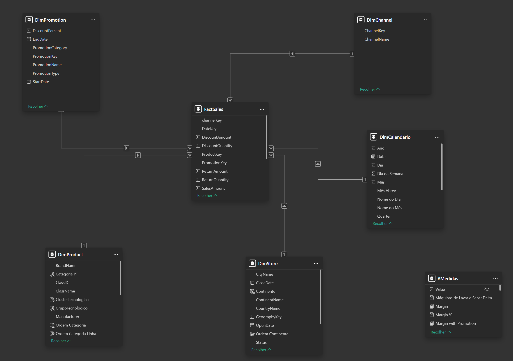
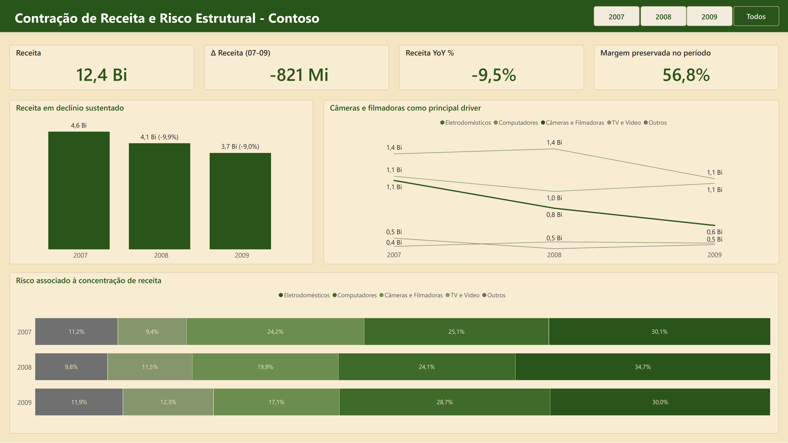
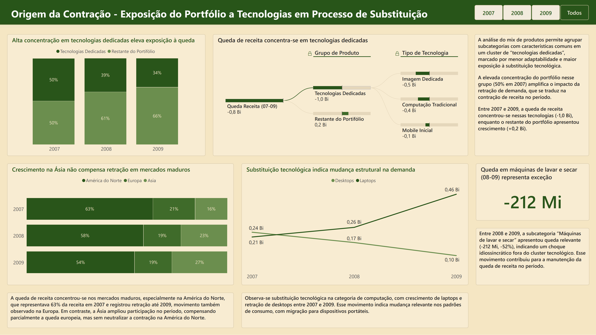

# Análise de Sustentabilidade — Contoso

Projeto de análise em Power BI sobre a estrutura de geração de receita da Contoso entre 2007 e 2009.

## Pergunta central

> O modelo de geração de resultados da Contoso é estruturalmente sustentável ao longo do tempo?

## Contexto

A Contoso é um dataset público da Microsoft, usado aqui como base para uma análise de portfólio e risco estrutural. Os dados cobrem vendas entre 2007 e 2009, com informações de produto, categoria e região.

## Modelagem de dados

O modelo foi construído em star schema, com a tabela fato **FactSales** conectada a cinco dimensões: **DimProduct**, **DimStore**, **DimPromotion**, **DimChannel** e **DimCalendário**, esta última criada para suportar cálculos com parâmetros temporais.

As medidas DAX que sustentam a análise publicada incluem receita total, margem, cálculo de variação percentual ano a ano (YoY%) e a variação absoluta em valor (YoY Delta).

## Principais achados

A receita da Contoso caiu de forma consistente no período, acumulando uma retração de aproximadamente -821 Mi (queda YoY média de -9,5%), enquanto a margem permaneceu estável (56%). O problema não estava na rentabilidade da operação, mas na concentração da receita e na deterioração de categorias específicas do portfólio.

A investigação identificou um conjunto de subcategorias com características em comum: menor adaptabilidade e alta exposição à substituição tecnológica. Esse conjunto foi nomeado **Tecnologias Dedicadas**. Produtos com função única, construídos para um uso específico, vulneráveis no momento em que a tecnologia evolui e esse uso passa a ser atendido por outro dispositivo.

Esse grupo é formado por três clusters tecnológicos:

- **Imagem Dedicada** — câmeras digitais e filmadoras, substituídas pelos smartphones à medida que estes integraram câmeras de qualidade crescente
- **Computação Tradicional** — desktops, pressionados pelo crescimento dos laptops (em 2007 as receitas eram semelhantes, ~200 Mi; em 2009 laptops chegaram a 460 Mi enquanto desktops caíram para 100 Mi)
- **Mobile Inicial** — PDAs e smartphones de função básica, absorvidos pela nova geração de dispositivos impulsionada principalmente pelo lançamento do iPhone em 2007

Sozinhos, esses clusters perderam **1,0 Bi** em receita no período, enquanto o restante do portfólio cresceu **+0,2 Bi**.

A concentração em Tecnologias Dedicadas caiu de 50% (2007) para 34% (2009). Não como resultado de uma estratégia comercial, mas como consequência da própria queda de demanda. A empresa encolheu junto com o grupo.

Essa hierarquia foi implementada em duas colunas calculadas na DimProduct: `ClusterTecnologico`, que agrupa as subcategorias de produto nos três clusters tecnológicos, e `GrupoTecnologico`, que separa o portfólio entre Tecnologias Dedicadas e Restante do Portfólio com base nesses clusters.

## Estrutura do relatório

O relatório foi dividido em duas páginas, seguindo a lógica narrativa **Exposição → Impacto → Evidência → Consequência → Risco**.

### Página 1 — Executive View

Responde rapidamente o que está acontecendo, qual a magnitude do problema e onde está o principal risco, sem aprofundar causas operacionais.

KPIs: Receita Total, Delta Receita (07-09), Receita YoY% e Margem. Esta última como contraponto, demonstrando que o problema é de receita, não de rentabilidade.

### Página 2 — Aprofundamento Analítico

Demonstra os efeitos da contração e por que ela representa risco estrutural, detalhando o grupo de Tecnologias Dedicadas e a evolução da concentração de receita.

## Ferramentas utilizadas

Power BI (modelagem, DAX e visualização)

## Links

🔗 [Acesse o relatório no Power BI](https://app.powerbi.com/view?r=eyJrIjoiNmJiMmQ4ZDgtMGY1Mi00OTFhLTk4OGUtNjBmYTZhOWYzZjU1IiwidCI6IjhhMzUxMjYzLWRkYmItNGFjMi1hMWZiLWIxYzJhZWY0ZTg5YiJ9)
&nbsp;&nbsp;
📄 [Leia o artigo no LinkedIn](https://www.linkedin.com/pulse/receita-em-queda-margem-intacta-o-que-estava-por-tr%C3%A1s-cruvinel-hqwlf/)
